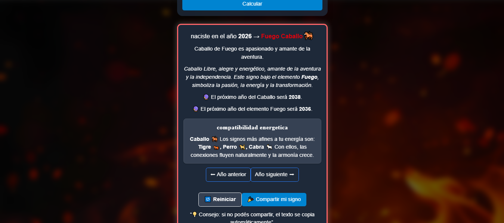

# 🐉 Calendario Chino – Ciclo Sexagenario

Aplicación web que permite calcular el signo y elemento del calendario chino según el año ingresado, basada en el ciclo sexagenario (Animales y Elementos).

## 🚀 Demo
👉 https://calendario-chino.vercel.app/

## 🛠️ Tecnologías
- JavaScript (ES6+)
- HTML5
- Tailwind
- React 

## ⚙️ Funcionalidades
- Cálculo del signo del zodiaco chino
- Determinación del elemento (madera, fuego, tierra, metal, agua)
- Implementación del ciclo sexagenario (60 combinaciones)
- Interfaz interactiva y dinámica

## 🧠 Lógica del proyecto
El ciclo sexagenario se basa en la combinación de:
- 5 elementos (madera, fuego, tierra, metal, agua) en este caso sin sus formas yin-yang
- 12 animales del zodiaco chino (ramas terrestres)s

Estas combinaciones generan un ciclo de 60 años.

La aplicación calcula:
- La posición del año dentro del ciclo
- Su correspondiente combinación de tronco + rama
- El animal y elemento asociado

## 📸 Capturas

